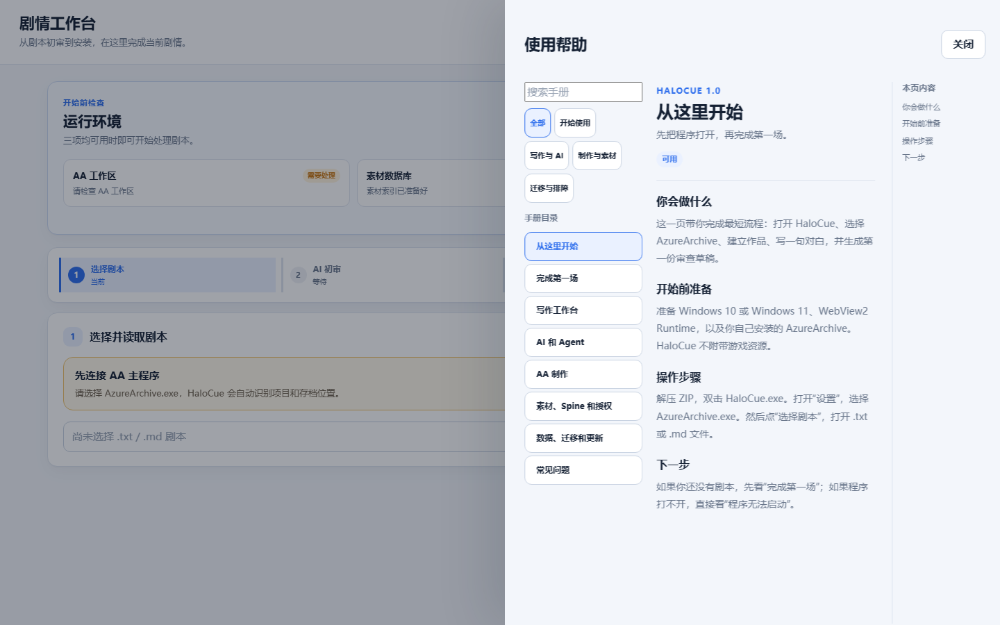

# HaloCue 使用手册

这套手册写给第一次使用 HaloCue 的人。遇到问题时，先看“开始使用”，再按你当前所在的页面查找对应章节。

## 开始使用

- [安装与第一次启动](01-安装与第一次启动.md)
- [完成第一场](02-完成第一场.md)

## 写作与 AI

- [写作工作台](10-写作工作台.md)
- [AI 和 Agent](11-AI和Agent.md)

## AA 制作

- [制作、审查和安装](20-AA制作.md)
- [素材、Spine 和授权](21-素材与授权.md)

## 数据与排错

- [数据、备份、迁移和更新](30-数据迁移与更新.md)
- [故障排查](31-故障排查.md)

## 阅读方法

每一页都按同样的顺序写：先说这页是做什么的，再说明需要准备什么，然后给出操作步骤和出错时的处理办法。页面里的按钮名称以 1.0 界面为准。

## 界面导览

帮助中心在桌面端使用三栏布局，窄屏会改成上下布局。下面两张图来自当前本地 UI，用来说明目录、正文和本页内容的位置。

